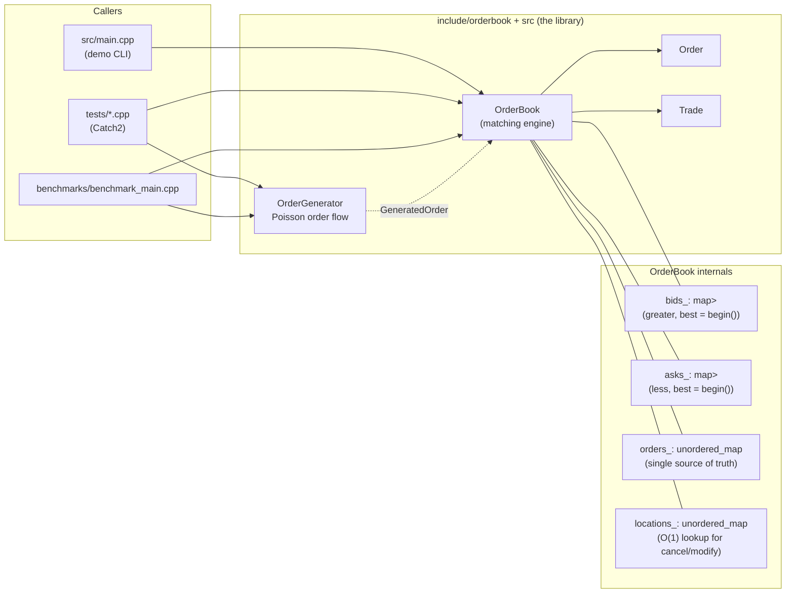

# C++ Limit Order Book & Matching Engine

A single-instrument, price-time-priority limit order book and matching
engine in modern C++20, with a deterministic synthetic order-flow
generator, a Catch2 correctness test suite, and a custom latency/throughput
benchmark harness.

This is a learning project, not production trading software -- see
[Limitations](#limitations) for what that means concretely.

## Table of contents

1. [Overview](#overview)
2. [Architecture](#architecture)
3. [Order lifecycle](#order-lifecycle)
4. [Matching rules](#matching-rules)
5. [Data structure choices](#data-structure-choices)
6. [Complexity analysis](#complexity-analysis)
7. [Build instructions](#build-instructions)
8. [Test instructions](#test-instructions)
9. [Benchmark instructions](#benchmark-instructions)
10. [Benchmark methodology](#benchmark-methodology)
11. [Benchmark results](#benchmark-results)
12. [Hardware / software environment](#hardware--software-environment)
13. [Example usage](#example-usage)
14. [Design tradeoffs](#design-tradeoffs)
15. [Limitations](#limitations)
16. [Future work](#future-work)

## Overview

The engine supports, for a single instrument:

- Limit and market order submission
- Cancellation and modification of resting orders
- Partial and complete fills, including a single incoming order sweeping
  many resting orders across many price levels
- Strict price-time priority matching
- A full order lifecycle (`New` / `PartiallyFilled` / `Filled` /
  `Cancelled`) with invalid operations failing cleanly (a `bool` or thrown
  `std::invalid_argument`, never silent corruption)

It also includes a deterministic, seedable synthetic order-flow generator
(Poisson arrivals) and a benchmark harness that measures throughput and
p50/p95/p99 latency for insertion, matching, cancellation, and
modification.

## Architecture



`OrderBook` is the only stateful class. `Order` and `Trade` are plain data;
`OrderGenerator` is a pure function of its `GeneratorConfig` (given the
same seed, it always returns the same sequence).

## Order lifecycle

```
        submit_limit_order() / submit_market_order()
                        |
                        v
      +---------- New (no fills yet) ----------+
      |                                         |
      | partial match                           | full match
      v                                         v
PartiallyFilled -------------------------> Filled (terminal)
      |
      | cancel_order()
      v
  Cancelled (terminal)
```

- **New**: accepted, resting, zero fills so far.
- **PartiallyFilled**: resting, `0 < filled_quantity() < quantity`.
- **Filled**: terminal. `remaining_quantity == 0`.
- **Cancelled**: terminal. Reached either by an explicit `cancel_order()`
  call, or -- for a **market** order specifically -- automatically, for
  whatever quantity could not be matched immediately (see
  [Matching rules](#matching-rules)).

Invalid transitions are rejected rather than silently applied:
double-cancellation, cancelling/modifying an order that is already
terminal, modifying a market order, and non-positive price/quantity all
return `false` (for cancel/modify) or throw `std::invalid_argument` (for
submission with a bad price/quantity, or a reused order id) rather than
mutating book state.

**Modification and priority.** This is the one lifecycle rule that is not
forced by physics -- different real exchanges make different choices here,
so this project picks one and documents it rather than leaving it
ambiguous:

> A change of **price**, or an **increase** in quantity, resets the
> order's time priority (implemented as cancel + replace: new sequence
> number, moved to the back of the -- possibly new -- price level's
> queue). A **decrease** in quantity at the *same* price preserves the
> order's existing position and sequence number.

This mirrors the rule used by several real equity exchanges (e.g. Nasdaq),
on the reasoning that shrinking a resting order cannot unfairly let it jump
ahead of orders that were already resting behind it, but growing it or
moving its price is economically equivalent to placing a new order and so
is treated as one. See `OrderBook::modify_order` in
[include/orderbook/OrderBook.hpp](include/orderbook/OrderBook.hpp) for the
implementation and
[tests/test_orderbook.cpp](tests/test_orderbook.cpp) (`[modify]` tag) for
the tests that pin this behavior down, including the case of modifying a
partially-filled order (its accumulated fill history is preserved across
the priority reset).

## Matching rules

**Best price first, then earliest order first at the same price** --
standard price-time priority (FIFO/pro-rata-by-arrival at each price
level):

- An incoming **buy** matches against the lowest-priced resting **sell**
  first; an incoming **sell** matches against the highest-priced resting
  **buy** first.
- Within a price level, the order that arrived first is matched first.
- A **limit** order matches while the best opposite price crosses its own
  limit price, sweeping additional price levels if a level is fully
  consumed; any unfilled remainder rests in the book.
- A **market** order matches at whatever the best available price is,
  with no price limit, sweeping levels the same way. Market orders are
  **IOC (immediate-or-cancel)**: they never rest, so any quantity that
  cannot be matched immediately is dropped -- reflected in the order's
  final status being `Filled` (fully matched) or `Cancelled` (some or all
  of the requested quantity could not be matched; `filled_quantity()`
  still reports exactly how much did trade before that decision is made).
- **Trades execute at the resting (maker) order's price**, never the
  taker's limit price -- the maker posted a firm, standing price and is
  entitled to it.

All of this is exercised directly in
[tests/test_orderbook.cpp](tests/test_orderbook.cpp), including the
specific edge cases called out in the assignment: several orders at one
price, one incoming order matching several resting orders across several
price levels, one resting order receiving several separate partial fills,
a market order sweeping multiple levels, and cancelling both the front and
a middle order of a price-level queue.

## Data structure choices

Each side of the book is `std::map<Price, std::deque<OrderId>>`:

- **`std::map` for price levels.** It keeps levels sorted at all times (a
  red-black tree), so the best bid/ask is always `begin()` --
  **O(1)** to read -- and locating, inserting, or erasing a specific price
  level is **O(log P)** where P is the number of distinct resting price
  levels. Critically, a `std::map` never invalidates iterators/references
  to elements it isn't currently touching, which is what lets this design
  safely cache `(side, price)` per order (see `locations_` below) without
  the cache being silently invalidated by unrelated inserts elsewhere in
  the tree.
- **`std::deque<OrderId>` for FIFO time priority.** New orders are
  `push_back`ed (**O(1)** amortized); the engine always matches against
  `front()` (**O(1)**). The deque stores `OrderId`, not the `Order` itself
  -- the single authoritative copy of every order's mutable state lives in
  `orders_` (`std::unordered_map<OrderId, Order>`, average **O(1)**
  lookup), so a fill only ever has to mutate one place.

**Why not cache iterators into the deque for O(1) cancel?** A `std::deque`
invalidates *all* of its iterators when an element is erased from the
middle (only erasing at the very front or back is iterator-stable). Orders
are cancelled from arbitrary positions in their queue, so a long-lived
cached iterator into a price-level deque is not safe here. This project
instead caches only `(side, price)` per order id (`locations_`, an
`unordered_map`) and does a linear scan of that price level's deque to
find the specific order being cancelled or modified. See
[Complexity analysis](#complexity-analysis) for the resulting cost and
[Design tradeoffs](#design-tradeoffs) for the alternative (an intrusive
linked list per level) that would avoid it, and why it wasn't used.

## Complexity analysis

Let **P** = number of distinct resting price levels on one side, **k** =
number of orders resting at one specific price level, **n** = total
resting orders on one side.

| Operation | Cost | Why |
|---|---|---|
| Best bid / best ask | **O(1)** | `map::begin()` |
| Locate a price level | **O(log P)** | `map::find` |
| Insert a new resting order | **O(log P)** amortized | `map::operator[]` (creates the level if new) + `deque::push_back` |
| Cancel / modify an existing order | **O(log P + k)** | `O(log P)` to find the level (via the `locations_` cache, actually O(1) average to find *which* level), `O(k)` linear scan of that level's deque to find the specific order |
| Submit an order that matches *m* resting orders | **O(m log P)** worst case | each of the *m* fills can exhaust a price level (an `O(log P)` erase); a fill that only partially consumes the front order is `O(1)` |

`orders_` and `locations_` lookups by `OrderId` are average-case **O(1)**
(`std::unordered_map`), with the caveat discussed in
[Design tradeoffs](#design-tradeoffs): an unreserved hash map occasionally
pays for an **O(n)** rehash on a single insert, which is exactly the tail
latency this project measured and then fixed with `OrderBook::reserve()`.

## Build instructions

Requires a C++20 compiler. No CMake or Make dependency -- the project is
small enough that a flat, direct compile of each translation unit is
simpler and more transparent than adding a build-system dependency (see
[Design tradeoffs](#design-tradeoffs)).

From a **bash / git-bash / MSYS2** shell:

```bash
./build.sh
```

From **native Windows PowerShell** (no bash required):

```powershell
.\build.ps1
```

Either produces:

- `bin/orderbook_demo(.exe)` -- runnable usage demo (see
  [Example usage](#example-usage))
- `bin/orderbook_tests(.exe)` -- the Catch2 correctness test suite
- `bin/orderbook_benchmark(.exe)` -- the benchmark harness

The library itself (`src/OrderBook.cpp`, `src/OrderGenerator.cpp` +
`include/orderbook/*.hpp`) has no dependency beyond the C++ standard
library. The test binary additionally vendors a single-header copy of
[Catch2 v2.13.10](https://github.com/catchorg/Catch2) at
`tests/third_party/catch.hpp` (checked into this repo, not fetched at
build time, so the build has no network dependency).

Compiler flags: `-std=c++20 -Wall -Wextra -Wpedantic`, `-O3 -DNDEBUG` for
the library/demo, `-O2` for the test binary, and additionally
`-march=native` for the benchmark binary (see
[Benchmark methodology](#benchmark-methodology) for why).

## Test instructions

```bash
./bin/orderbook_tests          # or bin\orderbook_tests.exe on Windows
```

Add `--success` to see every passing assertion, or `--list-tests` /
`-#` (tag expressions, e.g. `"[modify]"`) to filter -- standard Catch2 CLI.

**Actual result of the last run in this repo** (39 test cases spanning
insertion, matching, price priority, time priority, partial/complete
fills, multi-level matching, market orders, cancellation, modification,
empty-book behavior, invalid operations, and the invariants below):

```
===============================================================================
All tests passed (21998 assertions in 39 test cases)
```

## Benchmark instructions

```bash
./bin/orderbook_benchmark [num_orders] [seed]   # defaults: 200000, 42
```

e.g. `./bin/orderbook_benchmark 500000 7` for a larger, differently-seeded
run.

## Benchmark methodology

- **Timer**: `std::chrono::steady_clock` (monotonic, unaffected by
  wall-clock adjustments), sampled immediately before and after each
  individual operation under test.
- **Warm-up**: the first 10% of each scenario's iterations (minimum 1000)
  execute real operations against real book state, but are *not* recorded,
  so branch predictors, the allocator, and OS page mappings reach steady
  state before measurement begins. The remaining 90% are recorded.
- **Reported statistics**: mean, min, max, p50, p95, p99 latency in
  nanoseconds, computed by sorting the recorded sample set (nearest-rank
  method); plus end-to-end throughput (ops/sec) for the mixed workload.
- **Determinism**: every scenario is driven by a seeded `std::mt19937_64`
  (or, for the mixed workload, `OrderGenerator`'s own seeded Poisson
  process), so a re-run reproduces the same *sequence of operations*.
  Absolute timings will still vary between runs/machines with normal
  system noise -- that is expected and is why percentiles, not a single
  number, are reported.
- **Five scenarios**, chosen to isolate the operations the assignment
  calls out specifically:
  1. **Insert-only**: every order rests (an empty opposite book), so only
     `std::map` level lookup/insert + `std::deque::push_back` are on the
     hot path. Run twice -- without and with `OrderBook::reserve()` -- to
     make the effect described in
     [Design tradeoffs](#design-tradeoffs) directly visible in the numbers.
  2. **Matching-heavy**: a deep resting book (narrow price range, so many
     orders per level) is kept stocked with fresh, unmeasured liquidity;
     each measured order is sized to consume between roughly 1 and a few
     resting orders, exercising the full match loop including price-level
     exhaustion.
  3. **Cancellation**: pre-populate resting orders, then cancel them in a
     *randomly shuffled* (not insertion) order, so cancellations hit a mix
     of front/middle/back positions within their price-level queues --
     deliberately using few price levels so queues are long and the O(k)
     scan cost is actually visible.
  4. **Modification**: pre-populate resting orders; each is modified
     exactly once, randomly choosing between a priority-preserving
     quantity decrease and a priority-resetting price change, so both
     `modify_order()` code paths are represented in the same sample set.
  5. **Mixed realistic workload**: Poisson order flow from
     `OrderGenerator` drives new-order submission; cancels (15%) and
     modifies (10%) are interleaved against the pool of currently-resting
     orders, approximating a real session's operation mix. Reports the
     mix actually generated (counts of each op type, trades produced) and
     overall throughput alongside latency percentiles.
- **What "never fabricate benchmark numbers" means in practice here**: the
  numbers in the next section are pasted directly from a real run of
  `bin/orderbook_benchmark 200000 42` on the machine described in
  [Hardware / software environment](#hardware--software-environment). A
  full raw run is also checked in at
  [data/sample_benchmark_run.txt](data/sample_benchmark_run.txt) for
  reference. Re-running will reproduce the same *operation sequence* but
  not necessarily identical timings.

## Benchmark results

```
==================================================================
Order Book / Matching Engine -- Benchmark
==================================================================
Compiler       : GCC 16.2.0
Build flags    : -std=c++20 -O3 -march=native -DNDEBUG -Wall -Wextra -Wpedantic
CPU            : Intel64 Family 6 Model 154 Stepping 4, GenuineIntel
Logical cores  : 12
Workload size  : 200000 operations per scenario (unless noted)
Random seed    : 42
Warm-up        : first 10% of each scenario's iterations (min 1000), unrecorded
Timer          : std::chrono::steady_clock, per-operation sampling
==================================================================

Scenario: insert-only (200000 non-crossing limit orders)
-- insert, no reserve() --
  samples   : 180000
  mean      : 320.9 ns
  min       : 100 ns
  p50       : 200 ns
  p95       : 300 ns
  p99       : 400 ns
  max       : 6531300 ns

-- insert, with reserve() --
  samples   : 180000
  mean      : 267.4 ns
  min       : 100 ns
  p50       : 200 ns
  p95       : 300 ns
  p99       : 500 ns
  max       : 127600 ns

Scenario: matching-heavy (200000 crossing limit orders against a deep book)
-- match --
  samples   : 180000
  mean      : 151.6 ns
  min       : 0 ns
  p50       : 100 ns
  p95       : 200 ns
  p99       : 200 ns
  max       : 73900 ns

Scenario: cancellation (200000 resting orders, cancelled in random order)
-- cancel --
  samples   : 180000
  mean      : 599.9 ns
  min       : 100 ns
  p50       : 600 ns
  p95       : 900 ns
  p99       : 1100 ns
  max       : 158200 ns

Scenario: modification (200000 resting orders, each modified once)
-- modify --
  samples   : 180000
  mean      : 660.8 ns
  min       : 0 ns
  p50       : 600 ns
  p95       : 1400 ns
  p99       : 1800 ns
  max       : 218100 ns

Scenario: mixed realistic workload (Poisson order flow, seed=42)
-- mixed (all op types) --
  samples   : 180000
  mean      : 292.1 ns
  min       : 0 ns
  p50       : 200 ns
  p95       : 600 ns
  p99       : 800 ns
  max       : 119300 ns

  operation mix : 153036 new orders, 29858 cancels, 17106 modifies (126201 trades generated)
  elapsed       : 0.0625 s wall time for the full run (including warm-up)
  throughput    : 3201798 ops/sec (all operation types, full run including warm-up)
```

**What this shows, and one real bottleneck it found:**

- Steady-state per-operation latency is small and consistent across all
  four micro-benchmarks (p50 in the 100-600 ns range on this machine),
  which is the expected shape for O(log P) / O(log P + k) operations over
  a book with a modest number of price levels.
- `cancel`/`modify` p50s (~500-600 ns) are visibly higher than
  `insert`/`match` p50s (~100-200 ns): both benchmarks deliberately use a
  narrow price range (only ~200 distinct levels for 200,000 orders, so
  roughly 1000 orders per level) specifically to make the O(k) linear-scan
  cost of `erase_from_level` show up in the numbers rather than
  disappearing into the noise -- this is the tradeoff described in
  [Design tradeoffs](#design-tradeoffs), quantified.
- **The insert-only comparison is a real "inspect, find, fix, re-measure"
  result, not a staged one.** The first version of this benchmark showed
  occasional multi-millisecond max latencies (6.5 ms above) on an
  operation whose steady-state cost is ~300 ns -- a ~20,000x outlier.
  Because `orders_`/`locations_` are `std::unordered_map`s growing one
  `insert()` at a time with no pre-sizing, the suspect was a full-table
  rehash triggered by crossing the load-factor threshold on an unlucky
  insert. Adding `OrderBook::reserve(expected_orders)` (a plain
  `unordered_map::reserve`, no algorithmic change) and calling it once up
  front before the timed loop cut the max from **6.53 ms to 127 µs** -- a
  ~51x reduction in worst-case latency -- while p50/p95/p99 and mean were
  essentially unchanged, exactly as expected for a fix that only removes
  rare O(n) rehash events without changing any operation's average-case
  complexity. The other three scenarios call `reserve()` up front for the
  same reason (see their setup code in
  [benchmarks/benchmark_main.cpp](benchmarks/benchmark_main.cpp)).
- The remaining max-latency outliers (order of 10-200 µs, seen in every
  scenario) are consistent with ordinary OS scheduling jitter and
  page-fault-driven allocation growth on a general-purpose, non-realtime
  desktop OS rather than anything algorithmic -- see
  [Limitations](#limitations).
- `steady_clock` on this platform appears to report in ~100 ns
  granularity (note the round numbers), which is a measurement-resolution
  artifact, not evidence that every operation actually costs an exact
  multiple of 100 ns.

## Hardware / software environment

- **CPU**: 12th Gen Intel Core i5-1235U (reported by the OS as `Intel64
  Family 6 Model 154 Stepping 4, GenuineIntel`), 12 logical processors
- **OS**: Windows 11 Home Single Language, build 10.0.26200
- **Compiler**: `g++.exe (Rev3, Built by MSYS2 project) 16.2.0`, MSYS2
  UCRT64 toolchain, targeting `x86_64-w64-mingw32`
- **Flags**: see [Build instructions](#build-instructions) /
  [Benchmark methodology](#benchmark-methodology)

This is a single specific machine's numbers, not a claim about performance
on any other CPU, compiler, or OS -- re-run the benchmark on your own
hardware for numbers that apply to it (`-march=native` in particular
produces a binary tuned for, and only guaranteed correct on, the CPU it
was built on).

## Example usage

```cpp
#include "orderbook/OrderBook.hpp"
using namespace orderbook;

OrderBook book("DEMO");

// Resting liquidity: two sell orders, same price, FIFO order preserved.
book.submit_limit_order(/*id=*/1, Side::Sell, /*price=*/10010, /*qty=*/100);
book.submit_limit_order(/*id=*/2, Side::Sell, 10020, 200);

// An aggressive buy limit order sweeps both price levels.
std::vector<Trade> trades = book.submit_limit_order(3, Side::Buy, 10020, 250);
// trades[0]: taker=3 maker=1 price=10010 qty=100 (fully fills order 1)
// trades[1]: taker=3 maker=2 price=10020 qty=150 (partially fills order 2)

book.best_bid();               // std::nullopt (order 3 fully filled, nothing rests)
book.best_ask();                // 10020 (order 2 has 50 remaining)
book.get_order(2)->status;      // OrderStatus::PartiallyFilled

book.cancel_order(2);           // true
book.modify_order(2, std::nullopt, Quantity{10}); // false: already cancelled
```

Build and run the fuller version of this walkthrough (cancellation,
modification with and without a priority reset, market orders) with:

```bash
./bin/orderbook_demo
```

See [src/main.cpp](src/main.cpp) for the full annotated source, and
[tests/test_orderbook.cpp](tests/test_orderbook.cpp) for the complete
correctness specification expressed as tests.

## Design tradeoffs

- **Integer ticks, not floating point, for `Price`.** Matching correctness
  depends on exact price comparisons and exact price-level equality; IEEE
  754 doubles cannot represent most decimal prices exactly, and repeated
  comparisons on them can silently misroute an order. Callers pick a tick
  size (e.g. 1 tick = $0.01) and convert at the edges of the system. See
  [include/orderbook/Types.hpp](include/orderbook/Types.hpp).
- **Cancel/modify by linear scan of a `std::deque`, not a cached
  iterator.** As explained in
  [Data structure choices](#data-structure-choices), a `std::deque`
  invalidates all its iterators on a middle erase, so this project caches
  `(side, price)` and re-scans, costing O(k) instead of O(1). **The
  alternative** -- an intrusive doubly-linked list (`std::list<Order>`,
  or a hand-rolled intrusive list) per price level, with the order-id map
  caching a list iterator directly -- gives true O(1) cancel/modify at
  the cost of worse cache locality for the (usually short) FIFO queue at
  one price level, and was not used here because the assignment
  specifically asked for `std::deque`, and because O(k) with k bounded by
  "orders resting at one price" is a perfectly reasonable engineering
  tradeoff for a project of this scope (quantified, not just asserted --
  see [Benchmark results](#benchmark-results)).
- **No build system (no CMake/Make) beyond two flat shell scripts.** The
  project is three real translation units plus tests/benchmarks; a build
  system would add a dependency and a layer of indirection without buying
  anything at this scale. `build.sh` and `build.ps1` are the whole build.
- **Catch2, vendored as a single header, not fetched by the build.** No
  package manager (vcpkg/Conan) or CMake `FetchContent` is set up in this
  environment, and pulling one in for a project this size would be a
  bigger dependency than the test framework itself. A single vendored
  header (`tests/third_party/catch.hpp`) keeps the build hermetic (no
  network access needed to build) at the cost of a large file checked
  into the repo.
- **`OrderBook::reserve()` as an explicit, opt-in API**, rather than
  guessing a default capacity or having the constructor take an expected
  size. The book doesn't know its expected order volume; making the
  caller state it (when known) is honest about that, and calling it is
  optional -- everything works without it, just with worse tail latency
  (quantified in [Benchmark results](#benchmark-results)).
- **Market orders are IOC and use the existing 4-state lifecycle rather
  than adding a 5th status.** A market order's unfilled remainder (due to
  insufficient resting liquidity) is reported via the existing
  `Cancelled` status plus `filled_quantity()` for how much did trade,
  rather than inventing e.g. an `IOC_PartiallyCancelled` state, to keep
  the state machine the same size for both order types. This is a
  judgment call, documented at the point of decision in
  `OrderBook::submit_market_order`.

## Limitations

- **Single instrument, single thread.** No concurrency, no multi-symbol
  routing. See [Future work](#future-work) for what was deliberately left
  out and why.
- **No persistence or crash recovery.** The book is in-memory only; there
  is no journal/WAL and no snapshotting.
- **No network layer, no wire protocol.** Everything here is a library
  called in-process; there is no FIX/ITCH gateway, no client/server split.
- **The synthetic order generator is a simple, defensible model, not a
  calibrated one.** Poisson arrivals and a Gaussian price distribution
  around a mid price are standard first-order approximations of order
  flow, not a fit to any specific real market's actual microstructure.
- **Benchmark numbers are one machine, one run's worth of measurement**,
  not a statistically rigorous multi-run study with confidence intervals
  -- see [Hardware / software environment](#hardware--software-environment)
  and re-run locally before relying on any specific number.
- **Tail latency includes ordinary OS/allocator noise** (page faults,
  scheduler preemption) that this project did not attempt to eliminate
  (e.g. via huge pages, CPU pinning, or a custom allocator) -- see
  [Future work](#future-work).

## Future work

Explicitly out of scope for this project (would be reasonable next steps
for a version that took latency more seriously, not omissions from
carelessness):

- Multithreaded / lock-free matching
- FIX or ITCH protocol support
- Real exchange connectivity or real market-data replay
- Custom memory allocators / arena allocation for `Order` objects
- A network server (the engine is a library, not a service)
- Distributed matching, Kubernetes deployment

Smaller, more immediately actionable extensions:

- An intrusive-linked-list price-level implementation as a second,
  benchmarkable backend, to directly measure the O(1)-cancel /
  worse-cache-locality tradeoff described above rather than reasoning
  about it qualitatively.
- Multi-symbol support (a thin `OrderBook` registry keyed by symbol; the
  matching engine itself is already single-symbol by design).
- A simple text or binary order-entry protocol over a local socket, purely
  to exercise the engine from an external process rather than in-process
  calls (still explicitly not FIX/ITCH).
